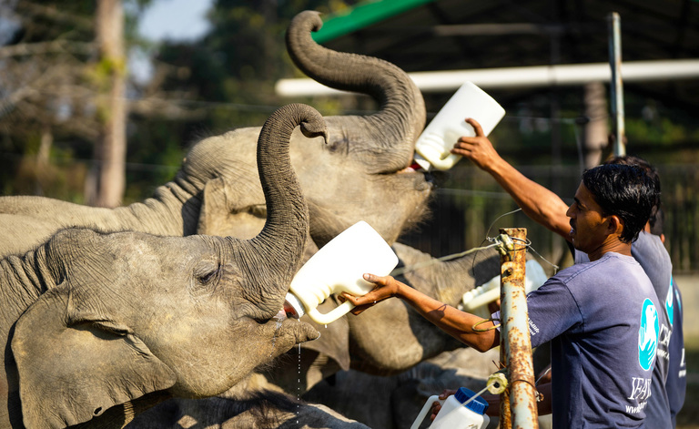

# 💼 CodSoft Artificial Intelligence Internship Project – June 2025 (Batch B31)

Welcome to my project repository for the **CodSoft Virtual Internship Program – Artificial Intelligence Domain**.  
This repository contains all the task-based projects I completed during the internship from **01 June 2025 to 30 June 2025**.

🔗 [CodSoft Official Website](https://www.codsoft.in/)

---

## 📋 Internship Details

- 🏢 Organization: [CodSoft](https://www.codsoft.in/)  
- 📅 Duration: June 2025 (1 Month)  
- 📚 Domain: Artificial Intelligence  
- 🧑‍💻 Intern: [Suman Sekhar Sahoo](https://www.linkedin.com/in/sumansekhar-sahoo)  
- 📍 Mode: Remote  

---

## ✅ Task 1 – Rule-Based ChatBot

This task involves creating a simple terminal-based chatbot that responds to user input using predefined rules. It does not use any AI models but instead relies on traditional logic, regex pattern matching, and styled output to simulate a conversation.

### 🔹 Features

- 🎨 Color-coded terminal chat bubbles using ANSI escape codes  
- 💬 Responds to greetings, help queries, moods, and identity-related questions  
- 🧠 Rule-based response generation using `if-else` and `re`  
- 😊 Emoji-based responses for better user experience  
- 📝 Optional chat history logging  

---

## 🛠️ Tools & Technologies

- Python 3.x  
- `re` (Regular Expressions)  
- ANSI escape codes for styling

---

## ✅ Task 2 – Tic-Tac-Toe AI Game

A web-based Tic-Tac-Toe game featuring an unbeatable AI opponent built with the Minimax algorithm.

### 🔹 Features
- 🤖 Smart AI (Minimax algorithm)  
- ✅ Win/Draw detection  
- 🔁 Game restart functionality  
- 🎯 Responsive and mobile-friendly UI  
- ♿ Basic accessibility support  

### 🛠️ Tools & Technologies
- HTML  
- CSS  
- JavaScript  

🔗 [View Project Folder](https://github.com/SumanSekhar-Sahoo/CODSOFT/tree/main/tic-tac-toe-ai)

---

## ✅ Task 3 – Image Captioning AI

📸 This project generates human-like captions from images using **CNN + RNN** architecture.

### 🔹 Description
An Image Captioning AI built using **VGG16** for feature extraction and **LSTM** for caption generation. This version includes a mock output for demonstration purposes.

### 🧠 Technologies Used
- Python
- TensorFlow & Keras
- VGG16 (Pre-trained)
- LSTM
- NumPy, Pillow (PIL)

### 🧪 Output Example
**Input Image:**  

**Generated Caption:** 
A group of baby elephants being bottle-fed by caretakers.

### 🛠️ How to Run

pip install tensorflow keras numpy pillow
python image_captioning.py

🔗 **[View Project Folder](./Image_Captioning)**
🔗 **[View LinkedIn Post](https://www.linkedin.com/posts/sumansekhar-sahoo_codesoft-machinelearning-deeplearning-activity-7335682994508124161-QnqY?utm_source=share&utm_medium=member_desktop&rcm=ACoAAFbWbFkBBD_ckmIB0-Z1ZAk25yadMwBisI0)**

---

## 📬 Connect With Me

👤 **Suman Sekhar Sahoo**
🔗 [LinkedIn](https://www.linkedin.com/in/sumansekhar-sahoo)
